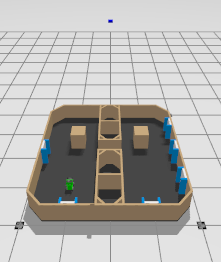
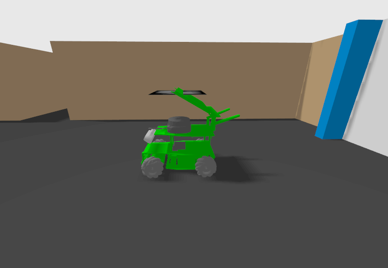
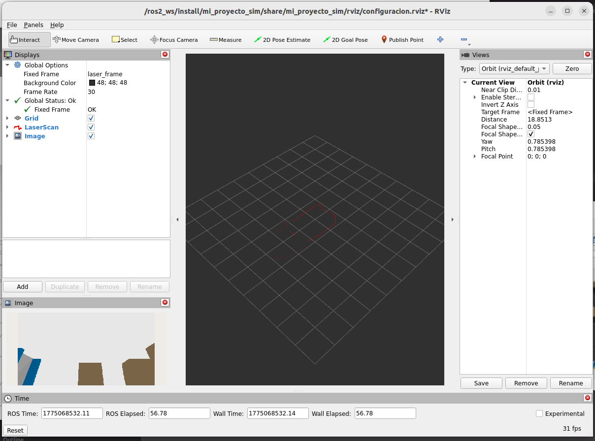
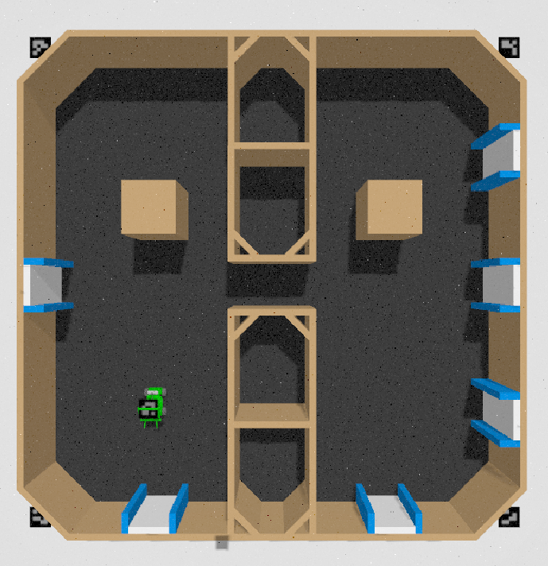

# Simulación de AGV/UAV con Yahboom Rosmaster X3 en Gazebo

Este repositorio contiene el entorno de simulación basado en ROS 2 (Humble) y Gazebo (Ignition) para el desarrollo de algoritmos de navegación, SLAM y visión artificial. 

> **Nota Importante:** Este repositorio es **exclusivo para la simulación**. El código base, los drivers y la plantilla para el despliegue en el hardware físico real se encuentran en el repositorio hermano: [port_bot_ws](https://github.com/CodingMaster8/port_bot_ws).

---

## Avances Actuales

Hasta el momento, el entorno de simulación cuenta con las siguientes características integradas:

* **Contenedorización Total:** El entorno completo corre bajo **Docker** utilizando `compose.yaml`, lo que asegura que las dependencias de ROS 2 y Gazebo estén aisladas, manteniendo el código fuente en el host para un desarrollo ágil (Volume Bind).
* **Integración de Modelos CAD:** Importación exitosa de un laberinto diseñado en SolidWorks hacia Gazebo.
  * Corrección de escalas milimétricas a metros (`.stl`).
  * Corrección de ejes de coordenadas (Rotación a Z-up).
  * Asignación de materiales y colores (Paredes de cartón, piso oscuro, y marcas azules y blancas).
* **Robot Spawner:** Integración del modelo URDF del robot **Yahboom Rosmaster X3** con ruedas Mecanum, apareciendo dinámicamente en coordenadas específicas dentro del laberinto.
* **Integración de Sensores y RViz2:** * Configuración del entorno de visualización para la telemetría del robot.
  * Visualización del escaneo láser (LiDAR) en tiempo real para aplicaciones de SLAM 2D.
  * Transmisión y visualización del feed de video de la cámara del dron en la simulación.

---

## Galería del Entorno

*(Capturas del entorno de simulación y la visualización de datos)*



*Vista superior del laberinto importado desde SolidWorks con sus materiales aplicados.*



*El robot Rosmaster X3 posicionado en las coordenadas de inicio dentro de la simulación.*



*Lectura de las paredes del laberinto utilizando el sensor LiDAR del Rosmaster X3 en RViz2.*



*Feed de video en tiempo real desde la perspectiva de la cámara del dron.*

---

## Cómo ejecutar la simulación

**1. Dar permisos de interfaz gráfica y levantar el contenedor:**
```
xhost +local:root
docker compose up -d --build
```

**2. Entrar a la terminal del contenedor:**
```
docker exec -it entorno_robotica bash
```

**3. Compilar el espacio de trabajo (Dentro del contenedor):**
```
colcon build --packages-select mi_proyecto_sim
source install/setup.bash
```

**4. Lanzar Gazebo y el Robot:**
```
ros2 launch mi_proyecto_sim launch_sim.launch.py
```
