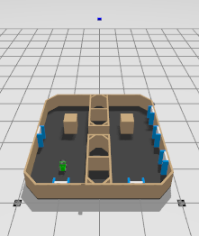
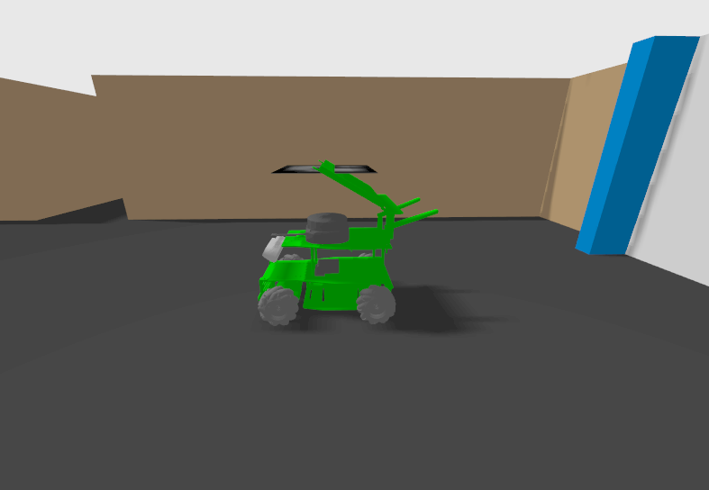
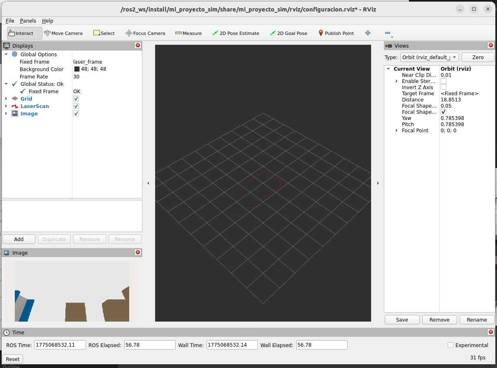
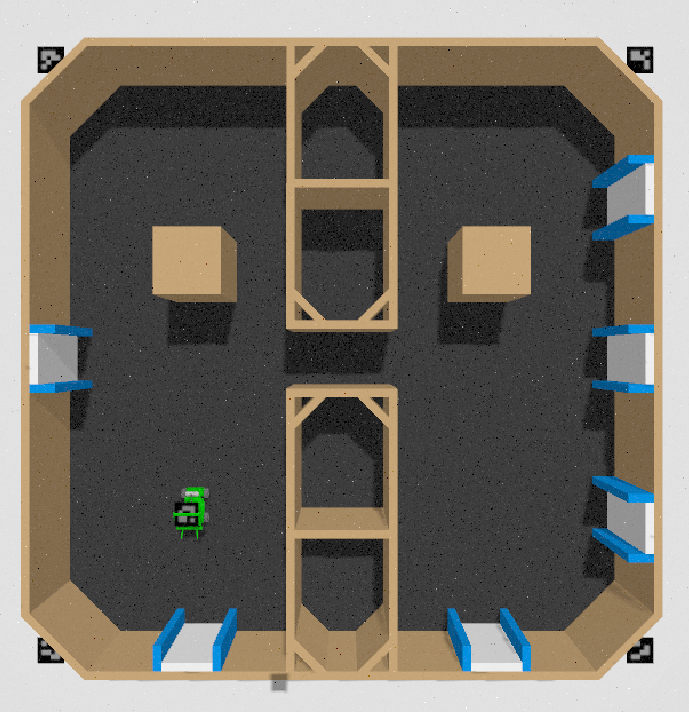

# Simulación de AGV/UAV con Yahboom Rosmaster X3 en Gazebo

Este repositorio contiene el entorno de simulación basado en ROS 2 (Humble) y Gazebo (Ignition) para el desarrollo de algoritmos de navegación, SLAM y visión artificial. 

> **Nota Importante:** Este repositorio es **exclusivo para la simulación**. El código base, los drivers y la plantilla para el despliegue en el hardware físico real se encuentran en el repositorio hermano: [port_bot_ws](https://github.com/CodingMaster8/port_bot_ws).

---

## Arquitectura del Sistema

El robot navega de forma autónoma a través de un laberinto utilizando un pipeline de tres capas:

```
┌─────────────────────────────────────────────────────────┐
│                    CAPA DE PERCEPCIÓN                   │
│  ┌──────────────┐  ┌──────────────┐  ┌──────────────┐  │
│  │  Dron + ArUco │  │  Odometría   │  │    LiDAR     │  │
│  │  (GPS visual) │  │  (Ruedas)    │  │  (Seguridad) │  │
│  └──────┬───────┘  └──────┬───────┘  └──────┬───────┘  │
│         │ 10%             │ 90%              │          │
│         └────────┬────────┘              Última         │
│                  ▼                       palabra        │
│         ┌────────────────┐                  │           │
│         │ Fusión Continua│                  │           │
│         │  (Pasa-baja)   │                  │           │
│         └───────┬────────┘                  │           │
│                 ▼                           │           │
│  ┌──────────────────────────────────────────▼────────┐  │
│  │        Controlador Kelly & Diaz + Evasión         │  │
│  │        (Potenciales Artificiales)                 │  │
│  └──────────────────────┬────────────────────────────┘  │
│                         ▼                               │
│                    /cmd_vel                              │
└─────────────────────────────────────────────────────────┘
```

### Componentes principales

| Nodo | Archivo | Función |
|------|---------|---------|
| `detector_aruco` | `detector_aruco.py` | Localización visual ArUco + Persistencia Snapshot JSON |
| `control_trayectoria` | `control_trayectoria.py` | Fusión de sensores + Kelly & Diaz + Evasión explosiva + Watchdog (4s) |
| `planificador_rrt` | `planificador_rrt.cpp` | Generación de rutas RRT con soporte para replanificación automática |
| `filtro_lidar` | `filtro_lidar.py` | Recorte del campo de visión del LiDAR a 190° |
| `generador_mapa` | `generador_mapa.py` | Generación automática del mapa de ocupación desde la cámara del dron |

### Fusión de Sensores (Odometría + ArUco)

El sistema utiliza un **filtro pasa-baja (α=0.1)** para fusionar la odometría de las ruedas con las detecciones ArUco:
- **90% Odometría**: Proporciona movimiento suave y continuo.
- **10% ArUco**: Corrige la deriva acumulada cada vez que la cámara del dron detecta el marcador.
- **Snapshot Persistente**: Almacena la última calibración exitosa en `config/last_snapshot.json`, permitiendo inicializar la navegación instantáneamente aunque el dron no vea los marcadores al arrancar.
- **Watchdog de Bloqueo**: Si el robot no avanza en su ruta durante **4 segundos**, solicita automáticamente una nueva ruta al planificador RRT.

### Evasión de Obstáculos y Seguridad

El sistema utiliza un campo de fuerza reactivo (Potenciales Artificiales) optimizado:
- **Frente** (cono de ±20°): Umbral de **35 cm** con frenado proporcional (v=0 a los 20 cm).
- **Lados** (±95°): Umbral de **25 cm** con repulsión explosiva (Ganancia 10.0) para evitar colisiones laterales.

---

## Avances Actuales

Hasta el momento, el entorno de simulación cuenta con las siguientes características integradas:

* **Contenedorización Total:** El entorno completo corre bajo **Docker** utilizando `compose.yaml`, lo que asegura que las dependencias de ROS 2 y Gazebo estén aisladas, manteniendo el código fuente en el host para un desarrollo ágil (Volume Bind).
* **Integración de Modelos CAD:** Importación exitosa de un laberinto diseñado en SolidWorks hacia Gazebo.
  * Corrección de escalas milimétricas a metros (`.stl`).
  * Corrección de ejes de coordenadas (Rotación a Z-up).
  * Asignación de materiales y colores (Paredes de cartón, piso oscuro, y marcas azules y blancas).
* **Robot con Física Real:** Integración del modelo URDF del **Yahboom Rosmaster X3** con plugin **MecanumDrive** para odometría física real (rotación de ruedas).
* **Navegación Autónoma:**
  * Planificación de rutas con **RRT** (Rapidly-exploring Random Trees).
  * Seguimiento de trayectoria con el controlador de **Kelly & Diaz**.
  * Fusión continua de **Odometría + ArUco** para localización robusta.
  * Evasión reactiva de obstáculos con **Potenciales Artificiales** y LiDAR.
* **Integración de Sensores y RViz2:**
  * Visualización del escaneo láser (LiDAR) en tiempo real.
  * Transmisión y visualización de la cámara del dron con detección de ArUco.
  * Visualización de la ruta RRT y la posición estimada del robot.

---

## Galería del Entorno

*(Capturas del entorno de simulación y la visualización de datos)*



*Vista superior del laberinto importado desde SolidWorks con sus materiales aplicados.*



*El robot Rosmaster X3 posicionado en las coordenadas de inicio dentro de la simulación.*



*Lectura de las paredes del laberinto utilizando el sensor LiDAR del Rosmaster X3 en RViz2.*



*Feed de video en tiempo real desde la perspectiva de la cámara del dron.*

---

## Estructura del Proyecto

```
src/mi_proyecto_sim/
├── launch/
│   └── simulacion.launch.py          # Orquestador principal
├── mi_proyecto_sim/
│   ├── control_trayectoria.py         # Controlador + fusión de sensores
│   ├── detector_aruco.py              # Localización visual (ArUco)
│   ├── filtro_lidar.py                # Filtro de campo de visión LiDAR
│   └── generador_mapa.py             # Generador de mapa de ocupación
├── src/
│   └── planificador_rrt.cpp           # Planificador de rutas RRT (C++)
├── urdf/
│   └── carrito_con_aruco.urdf.xacro   # Modelo del robot (MecanumDrive)
├── config/
│   └── xbox_mecanum.yaml              # Configuración del joystick
└── worlds/
    └── laberinto.sdf                  # Mundo de Gazebo
```

---

## Cómo ejecutar la simulación

**1. Dar permisos de interfaz gráfica y levantar el contenedor:**
```bash
xhost +local:root
docker compose up -d --build
```

**2. Entrar a la terminal del contenedor:**
```bash
docker exec -it entorno_robotica bash
```

**3. Compilar el espacio de trabajo (Dentro del contenedor):**
```bash
colcon build --packages-select mi_proyecto_sim
source install/setup.bash
```

**4. Lanzar la simulación completa (Gazebo + RViz + todos los nodos):**
```bash
ros2 launch mi_proyecto_sim simulacion.launch.py
```

**5. Iniciar la navegación autónoma (en otra terminal):**
```bash
ros2 run mi_proyecto_sim control_trayectoria
```
